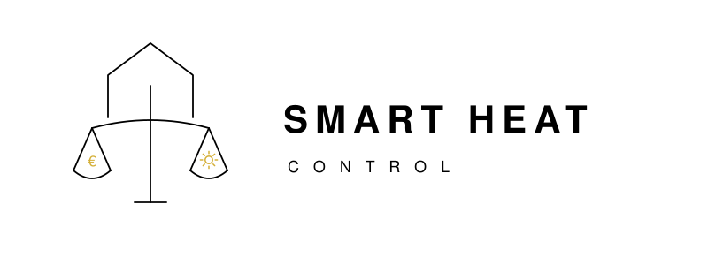

<p align="center">
  
</p>

**Pris- och väderstyrd optimering för värmepumpar, fjärrvärme och varmvattenberedare via Home Assistant.**  
*(English summary below.)*

[](https://github.com/hacs/integration)
[](https://github.com/tengmo-ab/smart-heat-control/releases)
[](LICENSE)

---

## Installation via HACS (rekommenderat)

Klicka på knappen nedan — den öppnar HACS i din Home Assistant-instans och lägger till repot med ett klick:

[](https://my.home-assistant.io/redirect/hacs_repository/?owner=tengmo-ab&repository=smart-heat-control&category=integration)

> **Kräver att HACS är installerat.** Om du inte har HACS: [hacs.xyz/docs/use/download/download](https://hacs.xyz/docs/use/download/download)

Efter att repot lagts till i HACS:
1. HACS → Integrations → sök *Smart Heat Control* → Download
2. Starta om Home Assistant
3. Settings → Integrations → Add Integration → *Smart Heat Control*
4. Följ 6-stegs config-flowet och peka ut dina entiteter

### Manuell installation

Kopiera mappen `custom_components/smart_heat_control/` till din HA:s `config/custom_components/` och starta om.

---

## Vad är detta?

Smart Heat Control är en HACS-integration som lägger ett intelligent styrlager *ovanpå* dina befintliga värme-entiteter i Home Assistant. Den läser ditt elpris (Nord Pool / Tibber / ENTSO-e), väderprognos, solelöverskott och kompressor-/tillsatseffekt, och skriver tillbaka till en `climate.*`-entitet, en `number.*`-entitet (värmekurva), och en `number.*`-entitet (varmvattenbörvärde) för att flytta elkonsumtionen till billiga timmar utan att förlora komfort.

Logiken kommer från en YAML-automation som körts dagligen i 2 år på en Comfortzone RX95 frånluftsvärmepump. v2 abstraherar bort märkesberoendet: integrationen jobbar mot *roller* (climate-entitet, värmekurv-number, varmvatten-number, kompressoreffekt-sensor osv.) som du pekar ut i ett config-flow vid installationen — den fungerar därmed mot Comfortzone, Nibe, IVT, Thermia, Mitsubishi, eller en kombination av fjärrvärme + separat varmvattenberedare.

## Designprinciper

1. **Allt är valfritt utom själva värmesystemet och utomhustemp.** Saknar du väderprognos? Logiken faller tillbaka på prisstyrning. Saknar du Nord Pool? Logiken kör väderanteciperad reduktion. Saknar du både och? Integrationen sätter dina standardvärden och avstår från optimering — komforten är säker, du förlorar bara besparingen.
2. **Tillfälligt trasiga sensorer ska inte krascha optimeringen.** Varje upstream-läsning som rapporterar `unavailable`/`unknown` eller är utanför rimligt intervall behandlas som `None`, och den specifika gren som behöver värdet inaktiveras tills nästa cykel. Andra grenar fortsätter köra.
3. **Den 2-åriga ordningsföljden är lag.** v2 är en 1:1-portering av kaskaden — inga "förbättringar" smygs in utan explicit godkännande.
4. **Stabila strängar för stats.** Modes (`Default`, `Cheap Price Intensify`, `Price Peak Reduction`, `Weather Anticipation Reduction`, `Mid-day Boost`, `Night Boost`, `Legionella Boost`, `Heating Priority`) byts inte utan migrationsplan eftersom de hamnar i HA:s state-historik.
5. **Anti-flap-hysteres för kompressorns skull.** Modes har en demand-nivå (Cheap Price > Default > Weather Anticipation > Price Peak; för VV: Legionella > Boost > Default > Heating Priority/Price Peak). *Nedgraderingar* (mot lägre demand) släpps alltid igenom omedelbart — du missar aldrig en pristopp eller en forcerad backoff. *Uppgraderingar* (mot högre demand) blockas i 20 minuter från senaste exit ur den mode du försöker gå tillbaka till, så att kompressorn inte accelereras-och-bromsas i 5-minutersintervall när priser/villkor pendlar nära en tröskel. Manuell switch-toggle (Master, Cheap Price, Price Peak, Weather, Legionella, Survive on Solar, eller den bundna Extra-HW) bypassar cooldown:en — användarintention slår alltid igenom direkt.
6. **Anti-overheat-override (v2-avvikelse).** Weather Anticipation triggar oavsett pris när inomhus-max under senaste timmen är ≥ default+1°C **och** dagens prognoserade högsta är ≥ 12°C **och** det inte är vinter. Förhindrar att huset pre-heatas på billiga nattimmar inför en morgon-pristopp när solen ändå kommer värma huset under dagen. V1 krävde alltid `current_price ≥ today_avg` för Weather Anticipation; v2 behåller den regeln som baseline men tillåter override:n när överhettningsrisken är tydlig.

## Arkitektur

```
custom_components/smart_heat_control/
├── manifest.json          ✅ HACS-metadata
├── const.py               ✅ DOMAIN, CONF_*, defaults, mode-strängar, tröskelvärden
├── config_flow.py         ✅ 6-stegs config-flow (heating → power → pricing → weather → solar → defaults)
├── models.py              ✅ Inputs / Computed / Decision / Health-dataclasser
├── computed.py            ✅ Beräkningslager (1:1-port av v1 variables:-block)
├── controller.py          ✅ Beslutskaskad (Weather → Price Peak → Cheap → Default + VV + legionella)
├── coordinator.py         ✅ DataUpdateCoordinator, _read_inputs, _apply, HW-reduktion SM
├── __init__.py            ✅ async_setup_entry / unload
├── switch.py              ✅ master_enabled, cheap_price, price_peak, weather, legionella, solar
├── number.py              ✅ default_indoor_temp, heat_curve, hw_temp, price_threshold, legionella
├── select.py              ✅ optimization_mode, hw_mode (read-only outputs)
├── sensor.py              ✅ AM/PM-snittpriser, future_highest_temp, days_since_legionella, m.fl.
├── binary_sensor.py       ✅ hw_reduction_active, is_evening_expensive, wait_for_sun
├── datetime.py            ✅ vacation_end, last_legionella_run
└── strings.json           ✅ Config-flow UI-labels
```

## Roller (vad du pekar ut i config-flowet)

| Steg | Roll | Krav | Exempel på format / sensor | Effekt om saknas |
| :-- | :-- | :-- | :-- | :-- |
| Heating system | `climate_entity` | **Krav** | `climate.*` entitet (t.ex. `climate.pump`) | — |
| Heating system | `outdoor_temp_sensor` | **Krav** | Sensor med state i °C (float, t.ex. `6.3`) | — |
| Heating system | `indoor_temp_sensor` | Valfri | Sensor med state i °C (float, t.ex. `22.2`) | Faller tillbaka på `climate.attributes.current_temperature` |
| Heating system | `heat_curve_number` | Valfri | `number.*` entitet (t.ex. state `32`) | Justering av värmekurva avstängd |
| Heating system | `hot_water_setpoint_number` | Valfri | `number.*` entitet (t.ex. state `50.0`) | All HW-styrning avstängd |
| Heating system | `hot_water_extra_switch` | Valfri | `switch.*` entitet (state `on`/`off`) | Detektering av extra varmvatten (VV) avstängd |
| Heating system | `hot_water_temp_sensor` | Valfri | Sensor med state i °C (t.ex. `48.5`) | Vissa HW-grenar förenklas |
| Heating system | `pump_activity_sensor` | Valfri | Sensor med specifikt state: `"Idle"`, `"Making Hot Water"`, `"Heating"`, `"Defrosting"` | VV-reduktion och vissa boost-grenar avstängda |
| Power | `compressor_power_sensor` | Valfri | Sensor med state i W eller kW (numeriskt) | "Full kompressor"-detektering avstängd |
| Power | `aux_power_sensor` | Valfri | Sensor med state i W eller kW (numeriskt) | Tillsatsskydd avstängt — kan ge mer tillsatsdrift |
| Pricing | `price_sensor` | **Krav för prisopt.** | Sensor med state i öre/kWh (t.ex. `119`) | Hela pris-grenen avstängd, väder-only |
| Pricing | `price_today_sensor` | **Starkt rekommenderad** | Sensor med attribut `prices` som en lista av 96 float-värden (eller `data` med dicts) | Utan denna: ingen Price Peak Reduction, ingen AM/PM-split, ingen Expensive Evening-detektion, inget today_avg. Endast `current_price` styr. |
| Weather | `weather_forecast_entity` | Valfri | `weather.*` (t.ex. `weather.smhi`) med ett `forecast` attribut för dygnsprognos | Månadsbaserad winter-fallback, väder-anticipation av |
| Solar/PV | `pv_excess_binary_sensor` | Valfri | `binary_sensor.*` (state `on`/`off`) | Inga PV-överskotts-justeringar |
| Solar/PV | `solar_forecast_today_sensor` | Valfri | Sensor med state i kWh (float, t.ex. `15.5`) | "Survive solar"-läget avstängt |
| Solar/PV | `battery_discharging_binary_sensor` | Valfri | `binary_sensor.*` (state `on`/`off`) | Batteristatus inte med i beslut |
| Solar/PV | `bridge_to_solar_binary_sensor` | Valfri | `binary_sensor.*` (state `on`/`off`) | Bridge-undantag i Price Peak avstängt |
| Solar/PV | `is_sunny_day_binary_sensor` | Valfri | `binary_sensor.*` (state `on`/`off`) | Soldags-heuristik från `weather_forecast.condition` |

## Robusthetstrappa

```
allt fungerar               → full kaskad (Weather > Price Peak > Cheap > Default)
pris saknas tillfälligt     → väder-only (Weather Anticipation + Default)
väder saknas tillfälligt    → pris-only (Price Peak + Cheap + Default)
båda saknas                 → endast Default-grenen, dina default-värden, ingen optimering
indoor/outdoor temp saknas  → safe-mode: skriv inget, logga, vänta på återställning
```

Integrationen rapporterar nedgraderingen via `select.smart_heat_control_optimization_mode` så du ser vilken nivå den jobbar på.

## Roadmap

- [x] Skelett: manifest, const, config_flow, `__init__`, coordinator, models
- [x] Computed-lager (1:1-port av v1 `variables:`-block, kvartalsprisanalys)
- [x] Controller (1:1-port av v1 kaskad — Weather → Price Peak → Cheap → Default + VV + legionella)
- [x] Entity-plattformar (switch, number, select, sensor, binary_sensor, datetime)
- [x] Coordinator med rolling buffers, HW-reduktion state machine, write-only-if-changed
- [x] Engelska översättningar (`translations/en.json`)
- [x] PNG-ikoner för HA 2026.3 local-brands (`brand/icon.png` + `logo.png` + @2x)
- [ ] Svenska översättningar (`translations/sv.json`)
- [ ] Testsvit (`tests/test_controller.py` med scenario per gren)
- [ ] Diagnostik (redacted dump för felsökning)
- [ ] Stats-migrationsguide för existerande v1-användare (comfortzone_settings_controller)
- [ ] HACS-listning (default store)

## Licens

[Apache License 2.0](LICENSE)

---

# 🇬🇧 English summary

Smart Heat Control is a Home Assistant integration that adds price- and weather-aware optimization on top of any heat pump, district heating system, or hot water boiler.

## One-click install via HACS

[](https://my.home-assistant.io/redirect/hacs_repository/?owner=tengmo-ab&repository=smart-heat-control&category=integration)

Requires [HACS](https://hacs.xyz) to be installed. After adding the repository: HACS → Integrations → Search "Smart Heat Control" → Download → Restart HA → Settings → Integrations → Add → Smart Heat Control.

## What it does

Reads your spot price (Nord Pool / Tibber / ENTSO-e), weather forecast, PV surplus, and compressor/aux power, and writes back to a `climate.*` entity, a heating-curve `number.*` entity, and a hot-water-setpoint `number.*` entity to shift consumption to cheap hours without losing comfort.

The logic is a 1:1 port of a proven YAML automation that ran for two years on a Comfortzone RX95 exhaust-air heat pump. In v2, it is abstracted to work with any vendor through entity-role bindings in the config flow.

**Core idea:** Every upstream entity except the climate entity and outdoor temperature is optional. Missing weather forecast? It falls back to price-only optimization. Missing price? Weather-only optimization. Missing both? It uses safe defaults — comfort is preserved, but savings are forfeited.

## Supported systems

Any heating system exposed as a `climate.*` entity in Home Assistant, including:
- Comfortzone (RX95, etc.) via [ha-comfortzone](https://github.com/danbull21/ha-comfortzone)
- Nibe via [ha-nibe](https://github.com/elupus/hass_nibe)
- IVT, Thermia, Mitsubishi, etc. via their respective integrations
- District heating + separate hot water boiler

## License

[Apache License 2.0](LICENSE)
