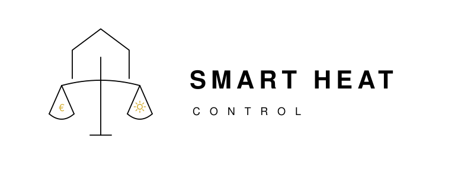

<p align="center">
  
</p>

**Pris- och väderstyrd optimering för värmepumpar, fjärrvärme och varmvattenberedare via Home Assistant.**  
*(English summary below.)*

[](https://github.com/hacs/integration)
[](https://github.com/tengmo-ab/smart-heat-control/releases)
[](LICENSE)

---

## Installation via HACS (rekommenderat)

Klicka på knappen nedan — den öppnar HACS i din Home Assistant-instans och lägger till repot med ett klick:

[](https://my.home-assistant.io/redirect/hacs_repository/?owner=tengmo-ab&repository=smart-heat-control&category=integration)

> **Kräver att HACS är installerat.** Om du inte har HACS: [hacs.xyz/docs/use/download/download](https://hacs.xyz/docs/use/download/download)

Efter att repot lagts till i HACS:
1. HACS → Integrations → sök *Smart Heat Control* → Download
2. Starta om Home Assistant
3. Settings → Integrations → Add Integration → *Smart Heat Control*
4. Följ 6-stegs config-flowet och peka ut dina entiteter

### Manuell installation

Kopiera mappen `custom_components/smart_heat_control/` till din HA:s `config/custom_components/` och starta om.

---

## Vad är detta?

Smart Heat Control är en HACS-integration som lägger ett intelligent styrlager *ovanpå* dina befintliga värme-entiteter i Home Assistant. Den läser ditt elpris (Nord Pool / Tibber / ENTSO-e), väderprognos, solelöverskott och kompressor-/tillsatseffekt, och skriver tillbaka till en `climate.*`-entitet, en `number.*`-entitet (värmekurva), och en `number.*`-entitet (varmvattenbörvärde) för att flytta elkonsumtionen till billiga timmar utan att förlora komfort.

Logiken kommer från en YAML-automation som körts dagligen i 2 år på en Comfortzone RX95 frånluftsvärmepump. v2 abstraherar bort märkesberoendet: integrationen jobbar mot *roller* (climate-entitet, värmekurv-number, varmvatten-number, kompressoreffekt-sensor osv.) som du pekar ut i ett config-flow vid installationen — den fungerar därmed mot Comfortzone, Nibe, IVT, Thermia, Mitsubishi, eller en kombination av fjärrvärme + separat varmvattenberedare.

## Designprinciper

1. **Allt är valfritt utom själva värmesystemet och utomhustemp.** Saknar du väderprognos? Logiken faller tillbaka på prisstyrning. Saknar du Nord Pool? Logiken kör väderanteciperad reduktion. Saknar du både och? Integrationen sätter dina standardvärden och avstår från optimering — komforten är säker, du förlorar bara besparingen.
2. **Tillfälligt trasiga sensorer ska inte krascha optimeringen.** Varje upstream-läsning som rapporterar `unavailable`/`unknown` eller är utanför rimligt intervall behandlas som `None`, och den specifika gren som behöver värdet inaktiveras tills nästa cykel. Andra grenar fortsätter köra.
3. **Den 2-åriga ordningsföljden är lag.** v2 är en 1:1-portering av kaskaden — inga "förbättringar" smygs in utan explicit godkännande.
4. **Stabila strängar för stats.** Modes (`Default`, `Cheap Price Intensify`, `Price Peak Reduction`, `Weather Anticipation Reduction`, `Mid-day Boost`, `Night Boost`, `Legionella Boost`, `Heating Priority`) byts inte utan migrationsplan eftersom de hamnar i HA:s state-historik.
5. **Anti-flap-hysteres för kompressorns skull.** Modes har en demand-nivå (Cheap Price > Default > Weather Anticipation > Price Peak; för VV: Legionella > Boost > Default > Heating Priority/Price Peak). *Nedgraderingar* (mot lägre demand) släpps alltid igenom omedelbart — du missar aldrig en pristopp eller en forcerad backoff. *Uppgraderingar* (mot högre demand) blockas i 20 minuter från senaste exit ur den mode du försöker gå tillbaka till, så att kompressorn inte accelereras-och-bromsas i 5-minutersintervall när priser/villkor pendlar nära en tröskel. Manuell switch-toggle (Master, Cheap Price, Price Peak, Weather, Summer Mode, Legionella, Survive on Solar, eller den bundna Extra-HW) bypassar cooldown:en — användarintention slår alltid igenom direkt.
6. **Anti-overheat-override (v2-avvikelse).** Weather Anticipation triggar oavsett pris/tid när inomhus-max under senaste timmen är ≥ default+1°C **och** dagens prognoserade högsta är ≥ 12°C **och** det inte är vinter. Förhindrar att huset pre-heatas på billiga nattimmar inför en morgon-pristopp när solen ändå kommer värma huset under dagen. V1 krävde alltid `current_price ≥ today_avg` för Weather Anticipation; v2 behåller den regeln som baseline men tillåter override:n när överhettningsrisken är tydlig.
7. **Summer mode är en *regim*-detektor, inte ett stickprov (v2-avvikelse).** Inspirerad av Comfortzones inbyggda sommarfunktion, men med rikare data: när väderregimen säger "byggnaden behöver ingen köpt värme" triggas Weather Anticipation Reduction oavsett tid eller pris. **VV-logiken är oförändrad** — endast climate-grenen påverkas av denna gate.

   Signalen är **prognosens dygnsmedel** — `(högsta + lägsta) / 2` — viktat 60/40 över idag och imorgon. Dygnsmedlet saknar dygnscykel och bär säsongen i sig självt: en septemberdag 17/7 ger 12°C medan en junidag 20/13 ger 16.5°C, trots att båda "känns" som en 17-20-gradig eftermiddag. Ingen kalender, inget datum, ingen inställning att skruva på.

8. **Dynamisk hysteres som skalar med dygnsamplituden.** Gaten är en Schmitt-trigger: `exit` är ett fast komfortgolv (dygnsmedel < 12.5°C → huset vill ha grundvärme oavsett hur fin eftermiddagen ser ut), och `enter` ligger ett *band* ovanför. Bandet är inte konstant utan skalar med prognosens dygnsamplitud — exakt den storhet som gjorde den gamla detektorn brusig:

   | Årstid | Amplitud | Band | Enter | Exit |
   | :-- | --: | --: | --: | --: |
   | Midsommar | 6-8 K | 1.8-2.4 | 14.3-14.9 | 12.5 |
   | September | 10-11 K | 3.0 | 15.5 | 12.5 |

   Mellan `exit` och `enter` hålls föregående tillstånd — prognosbrus och dygnsrullningen av prognosindex kan inte toggla gaten. Trösklarna syns som attribut (`regime_temp_c`, `enter_above_c`, `exit_below_c`) på `binary_sensor.<enhetsnamn>_summer_mode_active`.

   **Bakgrund:** första implementationen (0.3.0) gatade på rullande 6 h utomhus-max mot en fast 12°C-tröskel. Det håller juni-augusti när natt-minimum ligger över tröskeln, men i höstväder är dygnsamplituden 9-11 K — samma signal korsar tröskeln **två gånger per dygn**, varje dygn. Summer mode föll ur på småtimmarna och kom tillbaka framåt förmiddagen, i veckor. En detektor vars insignal har en dygnscykel kan inte beskriva en årstid hur mycket hysteres man än lägger ovanpå. Samma sak gällde `future_highest_temp`, som byter från idag till imorgon kl 16 — gaten använder därför explicita kalenderindex.

9. **Entry är strängt, exit är snabbt.** Dagens och morgondagens högsta, uppmätt 6 h utomhus-max och en giltig inomhusavläsning är **entry-only**-kontroller — de kan aldrig tvinga fram en *exit*, eftersom en exit driven av en signal med dygnscykel är just buggen ovan. Tre saker verkar omedelbart åt båda håll: vinter, Summer Mode-switchen, och inomhusgolvet (`default - 1.0°C`). Komfort och användarintention slår alltid regimen. Saknas prognosen (omstart, väderentitet som laddar om) hålls föregående tillstånd i stället för att falla till `off` — vid kallstart är utgångsläget `off`, dvs huset får grundvärme tills den varma regimen är positivt bekräftad.

10. **Manuell override av summer mode.** `switch.<enhetsnamn>_summer_mode` (på som default) stänger av *enbart* summer-gaten; resten av kaskaden löper vidare oförändrad. Binärsensorn exponerar `manually_disabled` så du ser om `off` beror på vädret eller på dig. Toggeln räknas som user-action och bypassar anti-flap-cooldown — beslutet räknas om vid nästa cykel, inte om 20 minuter.
11. **HW Aux Guard — håll elpatronen borta från varmvatten när det är kallt.** Vid ≤ -5°C (med värmekurva 4.0 / inne 20-21°C) plockar en RX95 in elpatronen när den växlar till varmvatten, även med lägsta VV-prioritet: pumpen jäktar klart VV för att hinna tillbaka till ett värmebehov den upplever som akut. Guarden sänker det behovet medan VV-sessionen pågår, och gör sessionen kortare. Switch **HW Aux Guard** (av som default) + number **HW Aux Guard Outdoor Threshold** (heltal, default -5°C).

   - **Armeras** när pumpen står i `Making Hot Water`, utomhus ≤ tröskeln, inne ≥ `default − 1.5°C`, och elpatronen (≥ 100 W) setts under sessionen eller inom 15 min före den (den kör då redan och följer med in i VV).
   - **Värmebehov:** inne-mål och värmekurva sätts till `min(kaskad − 1, default − 1)`. Första termen gör att den biter även när kaskaden redan sänkt — en pump som tar in elpatronen vid −1.5 måste se −2.5 innan något händer. Andra termen gör att den biter när kaskaden *höjer* (Cheap Price 22°C / 6.0 skulle annars bara bli 21 / 5.0, fortfarande över default). Aldrig mer än 3 under default (21 → 18°C, 4.0 → 1.0), och aldrig högre än kaskaden själv valt. Räknas om från kaskaden varje cykel, så sänkningen ackumuleras aldrig.
   - **Kortare VV-körningar:** VV-målet sätts på samma sätt till `min(kaskad − 5, default − 5)`, golv 40°C — samma värde som kaskaden själv skriver när elpatronen drar över 1 kW (v1-gren 7). Den grenen finns alltså redan, men reagerar på elpatronens *momentana* effekt: så fort den tystnar studsar VV-målet tillbaka till 45-50°C mitt i körningen. Guarden håller VV-målet nere hela sessionen **och 60 min efter** — att återställa fullt börvärde precis när pumpen nått det sänkta skulle få den att starta en ny VV-körning direkt, en stopp/start-loop orsakad av vårt eget tak.
   - **Spärren håller hela sessionen.** Det är sänkningen som får elpatronen att slå av — släpper man när den tystnat återställs behovet och den kommer direkt tillbaka. Sessionen slutar omedelbart när pumpen går tillbaka till `Heating` (värmebehovet återställs då direkt); i andra lägen (`Idle` mellan kompressorcykler, `Defrosting`, sensor otillgänglig) först efter 10 min.
   - **Komfortskydd på uppmätt temperatur, inte på börvärden:** faller inne under `default − 1.5°C` släpps värmesänkningen för resten av sessionen (ingen återarmering runt golvet), liksom efter max 90 min. VV-taket ligger kvar — att avsluta VV fortare är just vad ett kallt hus behöver.
   - **Släpper allt direkt, inklusive efterhållningen,** om switchen eller Master slås av, om en legionella-boost är aktiv *eller startar i samma cykel*, eller om Extra VV är på. De två sista är VV-körningar där elpatronen *ska* gå — hög temperatur by design — och de kan vara långa. En Legionella Boost-VV-beslut rörs aldrig, även i cykeln som startar den.
   - **Händelsestyrd:** utöver 5-minuterspollningen körs cykeln direkt på de få tillståndskanter spärren bryr sig om — pumpen går in i VV när det är kallt, elpatronen passerar 100 W uppåt under en oarmerad session, eller pumpen går VV → Heating medan värmesänkningen är på. Max en sådan cykel per 60 s; en kant inom fönstret slås ihop till en efterföljande cykel i stället för att tappas. Med spärren avslagen, eller när det är varmare än tröskeln, blir det inga extra cykler alls. Extra cykler lägger inte till sampel i de rullande medelvärdena (kompressoreffekt, uppvärmningsandel), och cykler kan inte längre överlappa varandra.
   - Appliceras *efter* anti-flap-lagret: en hållen mode (blockerad uppgradering) spelar upp förra cykelns mål och skulle annars kunna maskera sänkningen i upp till 20 min.
   - `binary_sensor.<enhetsnamn>_hw_aux_guard_active` visar `heating_demand_lowered`, `hot_water_setpoint_lowered`, `hw_session_started`, `hw_setpoint_hold_until`, `elpatron_last_on` och `last_release_reason`, så varje session går att förklara i efterhand.
   - Kräver att `pump_activity_sensor` och `aux_power_sensor` är bundna (elpatronens effekt i W — för Comfortzone "Addition effect", inte "Estimated aux power consumption" som är fläkt + standby).

## Arkitektur

```
custom_components/smart_heat_control/
├── manifest.json          ✅ HACS-metadata
├── const.py               ✅ DOMAIN, CONF_*, defaults, mode-strängar, tröskelvärden
├── config_flow.py         ✅ 6-stegs config-flow (heating → power → pricing → weather → solar → defaults)
├── models.py              ✅ Inputs / Computed / Decision / Health-dataclasser
├── computed.py            ✅ Beräkningslager (1:1-port av v1 variables:-block)
├── controller.py          ✅ Beslutskaskad (Weather → Price Peak → Cheap → Default + VV + legionella) + HW aux guard-tak
├── hw_aux_guard.py        ✅ VV-sessionsspärr som håller elpatronen borta från kall-VV
├── coordinator.py         ✅ DataUpdateCoordinator, _read_inputs, _apply, HW-reduktion SM
├── __init__.py            ✅ async_setup_entry / unload
├── switch.py              ✅ master_enabled, cheap_price, price_peak, weather, summer_mode, legionella, solar, hw_aux_guard
├── number.py              ✅ default_indoor_temp, heat_curve, hw_temp, price_threshold, legionella, hw_aux_guard_outdoor_threshold
├── select.py              ✅ optimization_mode, hw_mode (read-only outputs)
├── sensor.py              ✅ AM/PM-snittpriser, future_highest_temp, days_since_legionella, m.fl.
├── binary_sensor.py       ✅ hw_reduction_active, is_evening_expensive, wait_for_sun, is_summer_mode, hw_aux_guard_active
├── datetime.py            ✅ vacation_end, last_legionella_run
└── strings.json           ✅ Config-flow UI-labels
```

## Roller (vad du pekar ut i config-flowet)

| Steg | Roll | Krav | Exempel på format / sensor | Effekt om saknas |
| :-- | :-- | :-- | :-- | :-- |
| Heating system | `climate_entity` | **Krav** | `climate.*` entitet (t.ex. `climate.pump`) | — |
| Heating system | `outdoor_temp_sensor` | **Krav** | Sensor med state i °C (float, t.ex. `6.3`) | — |
| Heating system | `indoor_temp_sensor` | Valfri | Sensor med state i °C (float, t.ex. `22.2`) | Faller tillbaka på `climate.attributes.current_temperature` |
| Heating system | `heat_curve_number` | Valfri | `number.*` entitet (t.ex. state `32`) | Justering av värmekurva avstängd |
| Heating system | `hot_water_setpoint_number` | Valfri | `number.*` entitet (t.ex. state `50.0`) | All HW-styrning avstängd |
| Heating system | `hot_water_extra_switch` | Valfri | `switch.*` entitet (state `on`/`off`) | Detektering av extra varmvatten (VV) avstängd |
| Heating system | `hot_water_temp_sensor` | Valfri | Sensor med state i °C (t.ex. `48.5`) | Vissa HW-grenar förenklas |
| Heating system | `pump_activity_sensor` | Valfri | Sensor med specifikt state: `"Idle"`, `"Making Hot Water"`, `"Heating"`, `"Defrosting"` | VV-reduktion och vissa boost-grenar avstängda |
| Power | `compressor_power_sensor` | Valfri | Sensor med state i W eller kW (numeriskt) | "Full kompressor"-detektering avstängd |
| Power | `aux_power_sensor` | Valfri | Sensor med state i W eller kW (numeriskt) | Tillsatsskydd avstängt — kan ge mer tillsatsdrift |
| Pricing | `price_sensor` | **Krav för prisopt.** | Sensor med state i öre/kWh (t.ex. `119`) | Hela pris-grenen avstängd, väder-only |
| Pricing | `price_today_sensor` | **Starkt rekommenderad** | Sensor med attribut `prices` som en lista av 96 float-värden (eller `data` med dicts) | Utan denna: ingen Price Peak Reduction, ingen AM/PM-split, ingen Expensive Evening-detektion, inget today_avg. Endast `current_price` styr. |
| Weather | `weather_forecast_entity` | Valfri | `weather.*` (t.ex. `weather.smhi`) med ett `forecast` attribut för dygnsprognos | Månadsbaserad winter-fallback, väder-anticipation av |
| Solar/PV | `pv_excess_binary_sensor` | Valfri | `binary_sensor.*` (state `on`/`off`) | Inga PV-överskotts-justeringar |
| Solar/PV | `solar_forecast_today_sensor` | Valfri | Sensor med state i kWh (float, t.ex. `15.5`) | "Survive solar"-läget avstängt |
| Solar/PV | `battery_discharging_binary_sensor` | Valfri | `binary_sensor.*` (state `on`/`off`) | Batteristatus inte med i beslut |
| Solar/PV | `bridge_to_solar_binary_sensor` | Valfri | `binary_sensor.*` (state `on`/`off`) | Bridge-undantag i Price Peak avstängt |
| Solar/PV | `is_sunny_day_binary_sensor` | Valfri | `binary_sensor.*` (state `on`/`off`) | Soldags-heuristik från `weather_forecast.condition` |

## Robusthetstrappa

```
allt fungerar               → full kaskad (Weather > Price Peak > Cheap > Default)
pris saknas tillfälligt     → väder-only (Weather Anticipation + Default)
väder saknas tillfälligt    → pris-only (Price Peak + Cheap + Default)
båda saknas                 → endast Default-grenen, dina default-värden, ingen optimering
indoor/outdoor temp saknas  → safe-mode: skriv inget, logga, vänta på återställning
```

Integrationen rapporterar nedgraderingen via `select.smart_heat_control_optimization_mode` så du ser vilken nivå den jobbar på.

## Roadmap

- [x] Skelett: manifest, const, config_flow, `__init__`, coordinator, models
- [x] Computed-lager (1:1-port av v1 `variables:`-block, kvartalsprisanalys)
- [x] Controller (1:1-port av v1 kaskad — Weather → Price Peak → Cheap → Default + VV + legionella)
- [x] Entity-plattformar (switch, number, select, sensor, binary_sensor, datetime)
- [x] Coordinator med rolling buffers, HW-reduktion state machine, write-only-if-changed
- [x] Engelska översättningar (`translations/en.json`)
- [x] PNG-ikoner för HA 2026.3 local-brands (`brand/icon.png` + `logo.png` + @2x)
- [ ] Svenska översättningar (`translations/sv.json`)
- [ ] Testsvit (`tests/test_controller.py` med scenario per gren)
- [ ] Diagnostik (redacted dump för felsökning)
- [ ] Stats-migrationsguide för existerande v1-användare (comfortzone_settings_controller)
- [ ] HACS-listning (default store)

## Licens

[Apache License 2.0](LICENSE)

---

# 🇬🇧 English summary

Smart Heat Control is a Home Assistant integration that adds price- and weather-aware optimization on top of any heat pump, district heating system, or hot water boiler.

## One-click install via HACS

[](https://my.home-assistant.io/redirect/hacs_repository/?owner=tengmo-ab&repository=smart-heat-control&category=integration)

Requires [HACS](https://hacs.xyz) to be installed. After adding the repository: HACS → Integrations → Search "Smart Heat Control" → Download → Restart HA → Settings → Integrations → Add → Smart Heat Control.

## What it does

Reads your spot price (Nord Pool / Tibber / ENTSO-e), weather forecast, PV surplus, and compressor/aux power, and writes back to a `climate.*` entity, a heating-curve `number.*` entity, and a hot-water-setpoint `number.*` entity to shift consumption to cheap hours without losing comfort.

The logic is a 1:1 port of a proven YAML automation that ran for two years on a Comfortzone RX95 exhaust-air heat pump. In v2, it is abstracted to work with any vendor through entity-role bindings in the config flow.

**Core idea:** Every upstream entity except the climate entity and outdoor temperature is optional. Missing weather forecast? It falls back to price-only optimization. Missing price? Weather-only optimization. Missing both? It uses safe defaults — comfort is preserved, but savings are forfeited.

## Supported systems

Any heating system exposed as a `climate.*` entity in Home Assistant, including:
- Comfortzone (RX95, etc.) via [comfortzone](https://github.com/tengmo-ab/comfortzone) — the sibling integration I maintain that exposes the Comfortzone heat pump as native HA entities (climate, heat curve number, HW setpoint, pump activity status, etc.) — exactly the roles Smart Heat Control binds to in the config flow.
- Nibe via [ha-nibe](https://github.com/elupus/hass_nibe)
- IVT, Thermia, Mitsubishi, etc. via their respective integrations
- District heating + separate hot water boiler

## License

[Apache License 2.0](LICENSE)
